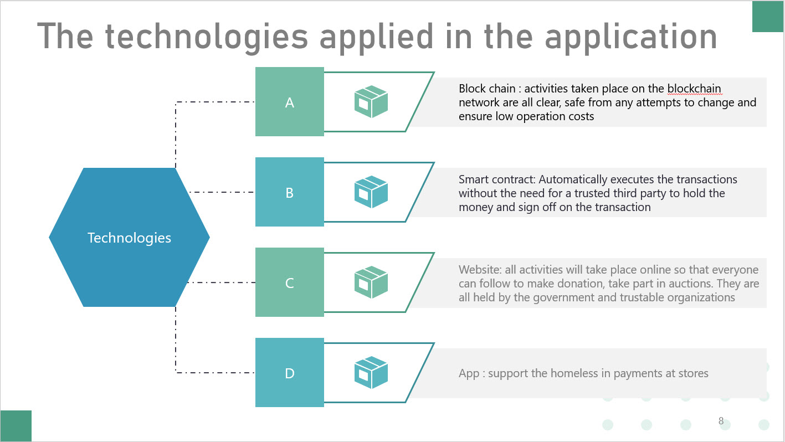

# Homeless DAPP Project
DoraHacks Global Hackathon Community

## Authors

* **Nguyễn Quốc Trường** - *Skill2job Services Joint Stock Company* - [Github](https://github.com/truong160196)

| | |
| ------ | ------ |
| Full Name| Nguyễn Quốc Trường|
| Company| Skill2job Services Joint Stock Company|
| Email| truong160196@gmail.com |

- follow project production: [remixwebsite.com](http://remixwebsite.com/)
## Introduce
Reasons for homelessness include shortages of affordable housing, privatization of civic services, investment speculation in housing, unplanned and rapid urbanization, as well as poverty, unemployment, and family breakdown.

- Every person needs food, water, personal commodities, clothes for daily survival. It will be unimaginable awful if those necessities are provided only once per week.  Provision of such necessities should instead take place everyday until they can reach a better condition.
- The distribution takes place under the risk of violence and insecurity.  The homeless have to wait in queues and some jump the queues struggling for the food. 
- Why not let them use the donated money to directly make the purchase themselves?

# Description project





## Scope
- Sign in Metamask to start the game
- The game at least provides 03 activities of using Crypto (send/receive/buy/sell)
- Basic graphic

### Prerequisites
| Name | Description |
| ------ | ------ |
| Module Bundler | [Webpack](https://webpack.js.org/) |
| Library Framework | [ReactJS](https://reactjs.org/), [Redux](https://redux.js.org/) |
| Library Server | [Axios](https://github.com/axios/axios) |
| CSS Framework | [Bootstrap](https://getbootstrap.com/docs/3.4/) |
| CSS | [css framework to reference osaka code(SCSS: react-bootstrap)](https://react-bootstrap.github.io/getting-started/introduction/) |
| React Packages | [React-Hot-Loader](https://github.com/gaearon/react-hot-loader/), [React-Router-Dom](https://github.com/ReactTraining/react-router), [React-Bootstrap-Daterangepicker](https://github.com/skratchdot/react-bootstrap-daterangepicker/) |
| Blockchain Framework | [Web3.js](https://web3js.readthedocs.io/en/v1.2.4/getting-started.html#adding-web3)|
| Ethereum Framework| [ethereumjs-tx](https://github.com/ethereumjs/ethereumjs-tx)|
| Game Framework | [Pixi.js](https://github.com/pixijs/pixi.js)|

## Installing

### Install library

```
npm install
```

### Start project

```
npm start
```
Go to browser for now
```
http://localhost:3006
```
# Public game
website public
[remixwebsite.com](http://remixwebsite.com/)

get Token QTN free at screen deposit
# Testnet

Using testnet [Ropsten](https://ropsten.etherscan.io/)

### extension browser require
You can install the MetaMask add-on in Chrome, Firefox, Opera, and the new Brave browser

download extension at [metamask.io](https://metamask.io/)
### Smart contract address

[0xb527FdE93d1dcC4F192E3eE42B219C0D81789F67](https://ropsten.etherscan.io/address/0xb527FdE93d1dcC4F192E3eE42B219C0D81789F67)

#### funtion

- update account
- Reward
- add/update/view item for account
- transfer item
- transfer gift
- add/update/view/delete store
### Token using
Token used to play the game;

[QTN](https://ropsten.etherscan.io/token/0xb527fde93d1dcc4f192e3ee42b219c0d81789f67)

### Token support
QTN, ETH

## Deployment

```
npm run build
```
path ./build


## License
Hackathon 2019
